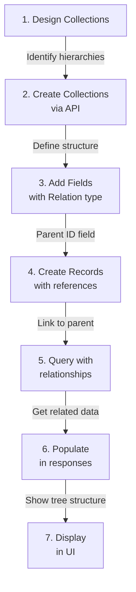

# 🔗 Implementing Relationship-Based Schemas in Your jayshree_blogs

## 📋 Table of Contents
1. [Current Project Overview](#current-project-overview)
2. [Understanding Relationships](#understanding-relationships)
3. [Implementation Strategies](#implementation-strategies)
4. [Step-by-Step Process](#step-by-step-process)
5. [Code Examples](#code-examples)
6. [Real-World Examples](#real-world-examples)

---

## Current Project Overview

Your jayshree_blogs/BaaS is a **dynamic schema builder** built with:
- **Frontend**: Next.js 16 + React 19 + Tailwind CSS + shadcn/ui
- **Backend**: Next.js API Routes
- **Database**: MongoDB
- **Current Capabilities**:
  - Create collections dynamically
  - Define fields with 9+ types
  - Support for "Relation" field type (basic)
  - Validation rules engine
  - File/Image uploads

**Current Structure**:
```
Collections (metadata tables)
  ├── id, name, display_name, description, icon, color
  └── created_at, updated_at

Fields (column definitions)
  ├── id, collection_id, name, display_name, field_type
  ├── is_required, is_unique, is_encrypted
  ├── validation_rules, relation_to_collection
  └── created_at, updated_at

Records (actual data)
  └── Stored in separate MongoDB collections per collection_name
```

---

## Understanding Relationships

### What Are Relationships?

Relationships define how data connects across different collections:

```
One-to-Many:        Many-to-One:         Many-to-Many:
┌────────────┐      ┌────────────┐       ┌────────────┐
│ Category   │1  ─→ │ Product    │       │ Student    │
└────────────┘    ∞ └────────────┘       └────────────┘
                                                ├─→ ← ─┤
                                         ┌────────────┐
                                         │   Course   │
                                         └────────────┘
```

### Why Use Relationships?

✅ **Data Integrity**: Avoid duplicating data  
✅ **Query Flexibility**: Filter/sort by related data  
✅ **Hierarchical Structure**: Category → Sub-category → Sub-sub-category  
✅ **Real-World Modeling**: Blog posts belong to categories  

---

## Implementation Strategies

### Strategy 1: Foreign Key Pattern (Recommended for Your Project)

Store the **parent ID** in the child record.

**Example - Category Hierarchy**:
```javascript
// CATEGORIES collection
{
  _id: ObjectId("111"),
  name: "Electronics",
  parent_id: null,                    // null = top-level category
  display_name: "Electronics",
  created_at: "2026-05-14T10:00:00Z"
}

{
  _id: ObjectId("222"),
  name: "Smartphones",
  parent_id: "111",                   // parent_id points to Electronics
  display_name: "Smartphones",
  created_at: "2026-05-14T10:01:00Z"
}

{
  _id: ObjectId("333"),
  name: "Android",
  parent_id: "222",                   // parent_id points to Smartphones
  display_name: "Android Phones",
  created_at: "2026-05-14T10:02:00Z"
}
```

**Advantages**:
- Simple to understand
- Efficient queries (no joins needed)
- Scales well with MongoDB
- Easy to filter by parent

**Disadvantages**:
- Need multiple queries to get full hierarchy
- Can create orphaned records

---

### Strategy 2: Nested Document Pattern

Store child data **inside** the parent document.

```javascript
// CATEGORIES collection
{
  _id: ObjectId("111"),
  name: "Electronics",
  display_name: "Electronics",
  subcategories: [
    {
      _id: ObjectId("222"),
      name: "Smartphones",
      display_name: "Smartphones",
      subcategories: [
        {
          _id: ObjectId("333"),
          name: "Android",
          display_name: "Android Phones"
        }
      ]
    }
  ]
}
```

**Advantages**:
- All data in one document
- Single query gets everything
- Better performance for small hierarchies

**Disadvantages**:
- Data duplication
- Document size limits (16MB)
- Complex updates
- Hard to query across hierarchy levels

---

### Strategy 3: Materialized Path Pattern

Store the **full path** to root in each record.

```javascript
{
  _id: ObjectId("333"),
  name: "Android",
  parent_id: "222",
  path: "111,222,333",                // CSV path to root
  depth: 2                             // nesting level
}
```

**Advantages**:
- Fast ancestor queries
- Easy to find all descendants
- Efficient sorting

**Disadvantages**:
- Updates required when moving nodes
- String parsing needed

---

## Step-by-Step Process

### ✅ Step 1: Design Your Collections

Define what collections you need:

```
1. CATEGORIES (with parent_id field)
2. BLOGS (with category_id field)
3. BLOG_CATEGORIES
```

### ✅ Step 2: Create Collections via API

```bash
POST /api/collections
{
  "name": "categories",
  "display_name": "Categories",
  "description": "Product categories with hierarchy",
  "icon": "folder",
  "color": "blue"
}

POST /api/collections
{
  "name": "blogs",
  "display_name": "Blog Posts",
  "description": "Blog posts linked to categories",
  "icon": "file-text",
  "color": "green"
}
```

### ✅ Step 3: Define Fields with Relationships

For **Categories** collection:
```javascript
POST /api/fields
{
  "collection_id": "categories_collection_id",
  "name": "name",
  "display_name": "Category Name",
  "field_type": "Text",
  "is_required": true
}

{
  "collection_id": "categories_collection_id",
  "name": "parent_id",
  "display_name": "Parent Category",
  "field_type": "Relation",
  "relation_to_collection": "categories",    // 👈 Self-reference!
  "description": "Leave empty for top-level categories"
}

{
  "collection_id": "categories_collection_id",
  "name": "slug",
  "display_name": "URL Slug",
  "field_type": "Text",
  "is_unique": true
}
```

For **Blogs** collection:
```javascript
POST /api/fields
{
  "collection_id": "blogs_collection_id",
  "name": "title",
  "display_name": "Post Title",
  "field_type": "Text",
  "is_required": true
}

{
  "collection_id": "blogs_collection_id",
  "name": "category_id",
  "display_name": "Category",
  "field_type": "Relation",
  "relation_to_collection": "categories",    // 👈 Points to categories
  "is_required": true
}

{
  "collection_id": "blogs_collection_id",
  "name": "content",
  "display_name": "Post Content",
  "field_type": "Editor"
}
```

### ✅ Step 4: Create Records with Relationships

```javascript
// Create top-level category
POST /api/data/categories
{
  "name": "Electronics",
  "parent_id": null,
  "slug": "electronics"
}
// Returns: { id: "111", name: "Electronics", parent_id: null, ... }

// Create sub-category
POST /api/data/categories
{
  "name": "Smartphones",
  "parent_id": "111",                    // Reference to parent
  "slug": "smartphones"
}
// Returns: { id: "222", name: "Smartphones", parent_id: "111", ... }

// Create blog post linked to category
POST /api/data/blogs
{
  "title": "Best Android Phones 2026",
  "category_id": "222",                  // Reference to category
  "content": "<h1>Best Android Phones</h1>..."
}
// Returns: { id: "blog_1", title: "...", category_id: "222", ... }
```

### ✅ Step 5: Query Relationships

**Get category with all descendants**:
```javascript
// GET /api/data/categories?parent_id=111
// Returns all categories with parent_id = 111
[
  {
    id: "222",
    name: "Smartphones",
    parent_id: "111"
  },
  {
    id: "224",
    name: "Laptops",
    parent_id: "111"
  }
]
```

**Get blog posts in a category**:
```javascript
// GET /api/data/blogs?category_id=222
// Returns all blogs where category_id = 222
[
  {
    id: "blog_1",
    title: "Best Android Phones 2026",
    category_id: "222"
  }
]
```

### ✅ Step 6: Populate Related Data (Join)

When returning a blog, include the category details:

```javascript
// GET /api/data/blogs/blog_1
// With population
{
  id: "blog_1",
  title: "Best Android Phones 2026",
  category_id: "222",
  category: {                           // 👈 Populated parent data
    id: "222",
    name: "Smartphones",
    parent_id: "111"
  }
}
```

---

## Code Examples

### Modified Type Definitions

Add to `lib/types.ts`:

```typescript
// Field can now specify if it's a self-referencing relation
export interface Field {
  // ... existing fields ...
  relation_to_collection?: string;
  is_self_referencing?: boolean;        // NEW: for hierarchy
  allow_multiple?: boolean;              // NEW: for many-to-many
}

// New types for relationships
export interface Relationship {
  field_id: string;
  from_collection: string;
  to_collection: string;
  type: 'one-to-many' | 'many-to-one' | 'many-to-many';
}
```

### Backend - Populate Related Records

Add to `lib/db.ts`:

```typescript
import { ObjectId } from 'mongodb';

// Get record with populated relationships
export async function getRecordWithRelations(
  collectionName: string,
  recordId: string,
  fieldsConfig: Field[]
) {
  const db = await getDb();
  const collection = db.collection(collectionName);
  
  const _id = oid(recordId);
  const record = await collection.findOne({ _id });
  
  if (!record) return null;

  // Find all relation fields
  const relationFields = fieldsConfig.filter(
    f => f.field_type === 'Relation'
  );

  // Populate each relation field
  for (const field of relationFields) {
    if (!field.relation_to_collection) continue;
    
    const relatedId = record[field.name];
    if (!relatedId) continue;

    const relatedCollection = db.collection(field.relation_to_collection);
    const relatedRecord = await relatedCollection.findOne({
      _id: oid(relatedId)
    });

    record[`${field.name}_populated`] = relatedRecord
      ? normalizeDocId(relatedRecord)
      : null;
  }

  return normalizeDocId(record);
}

// Get all records under a parent (for hierarchies)
export async function getChildRecords(
  collectionName: string,
  parentId: string,
  parentFieldName = 'parent_id'
) {
  const db = await getDb();
  const collection = db.collection(collectionName);

  const children = await collection
    .find({ [parentFieldName]: parentId })
    .sort({ created_at: 1 })
    .toArray();

  return children.map(normalizeDocId);
}

// Get full hierarchy tree
export async function getHierarchyTree(
  collectionName: string,
  parentId: string | null = null,
  parentFieldName = 'parent_id'
) {
  const db = await getDb();
  const collection = db.collection(collectionName);

  // Find records at this level
  const records = await collection
    .find({ [parentFieldName]: parentId })
    .sort({ created_at: 1 })
    .toArray();

  // Recursively build tree
  const tree = [];
  for (const record of records) {
    const normalized = normalizeDocId(record);
    const children = await getHierarchyTree(
      collectionName,
      normalized.id,
      parentFieldName
    );
    tree.push({
      ...normalized,
      children: children.length > 0 ? children : undefined
    });
  }

  return tree;
}

// Get all ancestors (full path to root)
export async function getAncestors(
  collectionName: string,
  recordId: string,
  parentFieldName = 'parent_id',
  ancestors: any[] = []
) {
  const db = await getDb();
  const collection = db.collection(collectionName);

  const _id = oid(recordId);
  const record = await collection.findOne({ _id });

  if (!record) return ancestors;

  const parent = record[parentFieldName];
  if (!parent) return ancestors;

  const parentRecord = await collection.findOne({
    _id: oid(parent)
  });

  if (parentRecord) {
    ancestors.unshift(normalizeDocId(parentRecord));
    return getAncestors(
      collectionName,
      parent,
      parentFieldName,
      ancestors
    );
  }

  return ancestors;
}
```

### API Endpoint - Get With Relations

Create `app/api/data/[collectionId]/[recordId]/route.ts`:

```typescript
import { NextRequest, NextResponse } from 'next/server';
import {
  getCollection,
  getCollectionFields,
  getRecord,
  getRecordWithRelations
} from '@/lib/db';
import { requireAuth } from '@/lib/auth';
import type { ApiResponse } from '@/lib/types';

export async function GET(
  request: NextRequest,
  {
    params
  }: {
    params: Promise<{ collectionId: string; recordId: string }>
  }
) {
  try {
    await requireAuth();
    const { collectionId, recordId } = await params;

    // Get collection
    const { data: collection } = await getCollection(collectionId);
    if (!collection) {
      return NextResponse.json(
        { success: false, error: 'Collection not found' } as ApiResponse<null>,
        { status: 404 }
      );
    }

    // Get fields to check for relations
    const { data: fields } = await getCollectionFields(collectionId);

    // Get record with populated relations
    const record = await getRecordWithRelations(
      collection.name,
      recordId,
      fields || []
    );

    if (!record) {
      return NextResponse.json(
        { success: false, error: 'Record not found' } as ApiResponse<null>,
        { status: 404 }
      );
    }

    return NextResponse.json(
      { success: true, data: record } as ApiResponse<typeof record>,
      { status: 200 }
    );
  } catch (error) {
    console.error('Get record error:', error);
    return NextResponse.json(
      { success: false, error: 'Internal server error' } as ApiResponse<null>,
      { status: 500 }
    );
  }
}
```

### API Endpoint - Get Hierarchy

Create `app/api/hierarchies/[collectionId]/route.ts`:

```typescript
import { NextRequest, NextResponse } from 'next/server';
import {
  getCollection,
  getHierarchyTree
} from '@/lib/db';
import { requireAuth } from '@/lib/auth';
import type { ApiResponse } from '@/lib/types';

export async function GET(
  request: NextRequest,
  { params }: { params: Promise<{ collectionId: string }> }
) {
  try {
    await requireAuth();
    const { collectionId } = await params;

    const { data: collection } = await getCollection(collectionId);
    if (!collection) {
      return NextResponse.json(
        { success: false, error: 'Collection not found' } as ApiResponse<null>,
        { status: 404 }
      );
    }

    // Get full hierarchy tree
    const tree = await getHierarchyTree(collection.name);

    return NextResponse.json(
      { success: true, data: tree } as ApiResponse<typeof tree>,
      { status: 200 }
    );
  } catch (error) {
    console.error('Get hierarchy error:', error);
    return NextResponse.json(
      { success: false, error: 'Internal server error' } as ApiResponse<null>,
      { status: 500 }
    );
  }
}
```

### Frontend - Hierarchical Category Selector

Create `components/hierarchical-selector.tsx`:

```typescript
'use client';

import { useEffect, useState } from 'react';
import {
  Select,
  SelectContent,
  SelectItem,
  SelectTrigger,
  SelectValue
} from '@/components/ui/select';
import type { Collection } from '@/lib/types';

interface HierarchyNode {
  id: string;
  name: string;
  depth: number;
  children?: HierarchyNode[];
}

interface Props {
  collectionId: string;
  onSelect: (recordId: string) => void;
  excludeIds?: string[];
}

export function HierarchicalSelector({
  collectionId,
  onSelect,
  excludeIds = []
}: Props) {
  const [tree, setTree] = useState<HierarchyNode[]>([]);
  const [loading, setLoading] = useState(true);

  useEffect(() => {
    fetchHierarchy();
  }, [collectionId]);

  async function fetchHierarchy() {
    try {
      const res = await fetch(`/api/hierarchies/${collectionId}`);
      const json = await res.json();
      if (json.success) {
        setTree(flattenTree(json.data, 0));
      }
    } catch (error) {
      console.error('Error fetching hierarchy:', error);
    } finally {
      setLoading(false);
    }
  }

  // Flatten tree for Select options
  function flattenTree(nodes: any[], depth = 0): HierarchyNode[] {
    let flattened: HierarchyNode[] = [];

    for (const node of nodes) {
      if (!excludeIds.includes(node.id)) {
        flattened.push({
          id: node.id,
          name: node.name,
          depth
        });
      }

      if (node.children) {
        flattened = flattened.concat(flattenTree(node.children, depth + 1));
      }
    }

    return flattened;
  }

  if (loading) return <div>Loading categories...</div>;

  return (
    <Select onValueChange={onSelect}>
      <SelectTrigger>
        <SelectValue placeholder="Select a category" />
      </SelectTrigger>
      <SelectContent>
        {tree.map(item => (
          <SelectItem key={item.id} value={item.id}>
            {/* Indent based on depth */}
            {'└─ '.repeat(item.depth)}
            {item.name}
          </SelectItem>
        ))}
      </SelectContent>
    </Select>
  );
}
```

---

## Real-World Examples

### Example 1: Product Category Hierarchy

```
Electronics (parent_id: null)
├── Computers (parent_id: Electronics)
│   ├── Laptops (parent_id: Computers)
│   │   ├── Gaming (parent_id: Laptops)
│   │   └── Business (parent_id: Laptops)
│   └── Desktops (parent_id: Computers)
└── Mobile Devices (parent_id: Electronics)
    ├── Smartphones (parent_id: Mobile Devices)
    └── Tablets (parent_id: Mobile Devices)
```

### Example 2: Blog Structure

```
Collections:
1. blog_categories
2. blogs (with category_id reference)

Data:
blog_categories:
  - ID: cat_1, name: "Technology", slug: "technology"
  - ID: cat_2, name: "Lifestyle", slug: "lifestyle"

blogs:
  - ID: post_1, title: "React 19 Guide", category_id: cat_1
  - ID: post_2, title: "Morning Routine", category_id: cat_2
```

### Example 3: Organizational Structure

```
Company (parent_id: null)
├── Engineering (parent_id: Company)
│   ├── Backend Team (parent_id: Engineering)
│   └── Frontend Team (parent_id: Engineering)
├── Marketing (parent_id: Company)
└── Sales (parent_id: Company)
    ├── Enterprise Sales (parent_id: Sales)
    └── Retail Sales (parent_id: Sales)
```

---

## Summary: The Complete Process



### Key Points:

1. **Collections** = Table definitions (schema)
2. **Fields** = Column definitions (with Relation type for links)
3. **Records** = Actual data (with parent_id or category_id values)
4. **Parent ID** = Foreign key storing reference to parent record
5. **Queries** = Filter by parent_id to find children
6. **Population** = Fetch related parent data and include in response
7. **Hierarchy** = Recursive queries to build tree structure

---

## Next Steps

1. ✅ Read this guide
2. ⬜ Implement hierarchy helper functions in `lib/db.ts`
3. ⬜ Create API endpoints for relationships
4. ⬜ Build UI component for selecting from hierarchies
5. ⬜ Test with sample data (categories → blogs)
6. ⬜ Extend validation to check parent exists before saving

